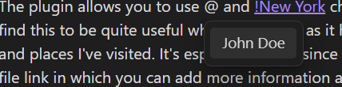
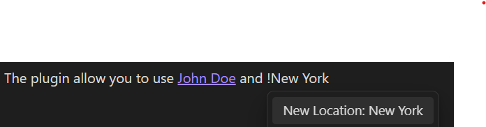

# Obsidian People & Location tracker

> Inspired by the existing [Obsidian-at-people](https://github.com/saibotsivad/obsidian-at-people) plugin, but extended slightly for my own use.

Obsidian plugin to add support for `@Person` and `!Place`.

The plugin allows you to use `@` and `!` characters to create links to people and places. I find this to be quite useful when journaling as it helps me build up a list of people I interact with and places I've visited. It's especially useful since each person or place is just another markdown file link in which you can add more information about them!

# How to use

Install the plugin from the community plugin list: 'Obsidian People & Location tracker'

You can also manually installing the plugin

-   Copy over `main.js`, `styles.css`, `manifest.json` from the [Releases page]() to your vault `VaultFolder/.obsidian/plugins/obisdian-journal-helper/`.

## How to contribute

This project uses TypeScript to provide type checking and documentation.
The repo depends on the latest plugin API (obsidian.d.ts) in TypeScript Definition format, which contains TSDoc comments describing what it does.

-   Clone this repo.
-   Make sure your NodeJS is at least v16 (`node --version`).
-   `npm i` or `yarn` to install dependencies.
-   `npm run dev` to start compilation in watch mode.

# License

Published and made available freely under the [MIT License](https://mit-license.org/)
